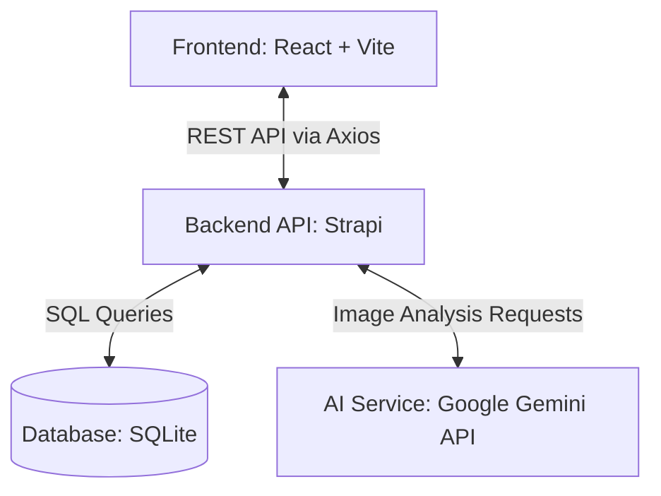

# AI Fitness Tracker

The AI Fitness Tracker is a modern, full-stack web application designed to help users monitor their daily nutritional intake and physical activities. By integrating AI-powered food image analysis, it simplifies the process of logging meals and estimating calories, providing users with an intuitive and seamless fitness journey.

## Features

- **User Authentication:** Secure login and registration.
- **Fitness Profile & Onboarding:** Personalized user profiles with fitness goals and physical metrics.
- **Dashboard & Progress Tracking:** Visualized daily summaries, calorie consumption vs. expenditure, and goal progress.
- **Food Logging:** Manual entry and history of consumed meals and their nutritional values.
- **Activity/Workout Tracking:** Logging of physical activities and calories burned.
- **AI-Powered Food Image Analysis:** Automatic identification of food items and calorie estimation from uploaded images.
- **Profile Management:** Update personal metrics, dietary preferences, and fitness goals.

## Tech Stack

| Technology | Purpose |
|---|---|
| **React 19 & TypeScript** | Frontend framework and static typing for scalable UI components |
| **Vite** | Lightning-fast frontend build tool and development server |
| **Tailwind CSS v4** | Utility-first CSS framework for rapid UI styling |
| **Recharts** | Composable charting library for dashboard visualizations |
| **Strapi v5 (Node.js)** | Headless CMS for rapid backend API development and content management |
| **SQLite** | Lightweight relational database for storing user data, logs, and profiles |
| **Strapi Users-Permissions**| JWT-based authentication and role-based access control |
| **Google Gen AI (Gemini)** | Backend AI integration for analyzing food images and extracting nutritional data |
| **Axios** | Promise-based HTTP client for API communication |

## Application Architecture

The application follows a standard client-server architecture with a headless CMS acting as the backend, supplemented by an external AI service for intelligent data processing.



## Project Structure

```text
ai-fitness-app/
├── client/                 # React frontend application
│   ├── src/
│   │   ├── assets/         # Static assets and mock data
│   │   ├── components/     # Reusable UI components (Sidebar, Charts, Inputs)
│   │   ├── configs/        # API configurations
│   │   ├── context/        # Global state management (Theme, App state)
│   │   ├── pages/          # Application routes (Dashboard, FoodLog, ActivityLog)
│   │   └── types/          # TypeScript definitions
│   ├── index.html
│   ├── package.json
│   ├── vite.config.ts
│   └── ...
├── server/                 # Strapi backend application
│   ├── config/             # Strapi configurations (database, server, plugins)
│   ├── database/           # SQLite database file and migrations
│   ├── public/             # Static public assets (uploads)
│   ├── src/
│   │   ├── api/            # Content-types and custom routes (activity-log, food-log, image-analysis)
│   │   └── extensions/     # Strapi plugin extensions (e.g., users-permissions)
│   ├── package.json
│   └── ...
└── .gitignore
```
